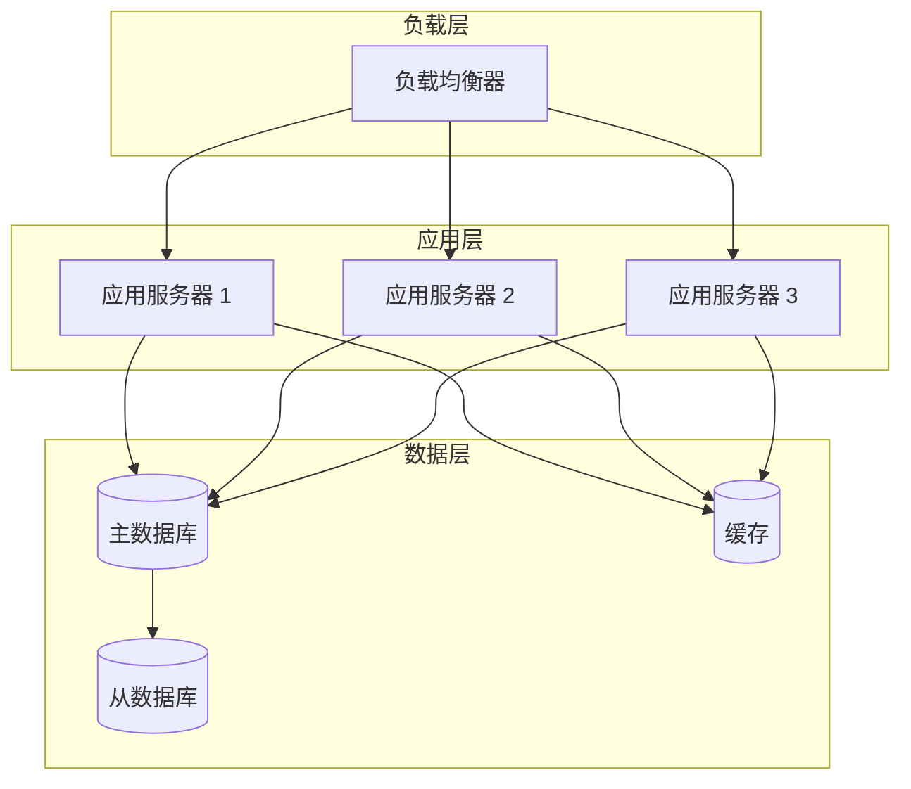

# 单轮对话

OpenCode 的单轮对话模式让您能够通过一次精心设计的对话完成复杂的任务，无需多次交互。本文将详细介绍单轮对话的设计原则、提示词优化、任务拆解、输出格式控制以及成功率提升技巧。

通过掌握单轮对话技巧，您可以大幅减少交互次数，提升任务完成速度和效率。

单轮对话就像是"全能助手"，一次对话就能完成所有事情。

## 单轮对话原理 💡

### 什么是单轮对话

在 OpenCode 中，**单轮对话**（Single Dialogue）是指通过一次输入，让 AI 一次性完成所有任务的工作模式。

**白话解释：**

就像"给快递员一个完整的包裹清单"：
- 📋 一次性列出所有要求
- 📦 快递员一次性打包好所有物品
- ✅ 无需多次往返

**单轮对话的特点：**

```
✅ 高效：一次对话完成所有任务
✅ 上下文完整：所有信息一次提供
✅ 依赖明确：任务之间的关系清晰
✅ 易于控制：输出格式可精确指定
```

---

## 单轮对话设计原则 📋

### 原则 1：任务完整性

确保所有必要信息一次性提供。

**示例：**

```markdown
# ❌ 不好的示例
用户：帮我写一个 Python 函数

# ✅ 好的示例
用户：帮我写一个 Python 函数，用于快速排序。
要求：
1. 使用递归算法
2. 添加详细注释
3. 包含时间复杂度说明
4. 提供使用示例
5. 添加单元测试
```

---

### 原则 2：结构化表达

使用清晰的结构组织需求。

**模板：**

```markdown
## 任务目标
[明确的目标描述]

## 输入数据
[输入数据的格式和内容]

## 输出要求
[输出格式的详细说明]

## 技术要求
[技术栈、规范等]

## 约束条件
[限制条件和注意事项]

## 示例
[输入输出示例]
```

---

### 原则 3：上下文自包含

避免依赖之前对话的内容。

**示例：**

```markdown
# ❌ 依赖上下文
用户：使用之前的配置
[需要查看之前对话]

# ✅ 自包含
用户：使用以下配置：
```yaml
database:
  host: localhost
  port: 5432
  name: mydb
```
[无需查看之前对话]
```

---

## 提示词优化技巧 🎯

### 技巧 1：使用角色设定

明确 AI 的角色，获得更专业的回答。

**示例：**

```markdown
你是一位资深的 Python 开发工程师，专精于算法优化。
请帮我实现一个高效的快速排序算法。

要求：
1. 使用 Python 3.10+ 语法
2. 考虑内存使用优化
3. 添加类型注解
4. 包含完整的文档字符串
```

---

### 技巧 2：分步骤引导

将复杂任务拆分为清晰步骤。

**示例：**

```markdown
请按照以下步骤完成任务：

步骤 1：分析需求
- 描述要解决的问题
- 列出关键功能点

步骤 2：设计方案
- 画出系统架构图
- 说明技术选型

步骤 3：实现代码
- 编写核心代码
- 添加必要注释

步骤 4：测试验证
- 提供测试用例
- 说明预期结果
```

---

### 技巧 3：指定输出格式

精确控制输出格式，便于后续处理。

**示例：**

```markdown
请按照以下格式输出：

```json
{
  "function_name": "string",
  "description": "string",
  "code": "string",
  "complexity": "string",
  "example": {
    "input": [],
    "output": []
  }
}
```
```

---

## 任务拆解策略 🧩

### 策略 1：功能模块拆分

将复杂功能拆分为独立模块。

**示例：**

```markdown
开发一个用户管理系统，包含以下模块：

模块 1：用户注册
- 表单验证
- 密码加密
- 邮件确认

模块 2：用户登录
- 认证流程
- JWT 生成
- 会话管理

模块 3：用户管理
- CRUD 操作
- 权限控制
- 数据导出

请为每个模块提供：
1. 接口设计
2. 代码实现
3. 测试用例
```

---

### 策略 2：数据流拆分

按照数据处理流程拆分。

**示例：**

```markdown
实现一个数据处理管道：

阶段 1：数据采集
- 从 API 获取数据
- 数据清洗和验证

阶段 2：数据转换
- 数据格式转换
- 特征提取

阶段 3：数据存储
- 存储到数据库
- 建立索引

阶段 4：数据分析
- 统计分析
- 可视化展示

请提供每个阶段的代码实现。
```

---

### 策略 3：依赖关系拆分

根据任务依赖关系拆分。

**示例：**

```markdown
实现一个电子商务系统：

前置任务：
1. 设计数据库 Schema
2. 创建基础模型

核心任务（依赖前置任务）：
3. 实现商品管理
4. 实现订单管理
5. 实现支付接口

增强任务（依赖核心任务）：
6. 实现搜索功能
7. 实现推荐系统
8. 实现数据分析

请按依赖顺序实现所有功能。
```

---

## 输出格式控制 📝

### JSON 格式输出

适用于结构化数据。

```markdown
请分析以下代码，输出 JSON 格式：

```python
def calculate_discount(price, discount_rate):
    return price * (1 - discount_rate)
```

输出格式：
```json
{
  "function_name": "calculate_discount",
  "parameters": [
    {"name": "price", "type": "float", "description": "商品价格"},
    {"name": "discount_rate", "type": "float", "description": "折扣率"}
  ],
  "return_type": "float",
  "complexity": "O(1)",
  "issues": [],
  "suggestions": []
}
```
```

---

### Markdown 格式输出

适用于文档和说明。

```markdown
请生成一份 API 文档，使用 Markdown 格式：

要求：
1. 包含接口概述
2. 列出所有端点
3. 说明请求参数
4. 提供响应示例
5. 添加错误码说明

输出格式：
```markdown
# API 文档

## 概述
...

## 接口列表
...

## 错误码
...
```
```

---

### 代码块格式输出

适用于代码实现。

```markdown
请实现一个用户认证系统，输出三个代码块：

代码块 1：数据库模型
```python
# models/user.py
...
```

代码块 2：认证服务
```python
# services/auth.py
...
```

代码块 3：API 接口
```python
# api/auth.py
...
```
```

---

## 成功率提升技巧 🚀

### 技巧 1：提供示例

通过示例明确期望。

**示例：**

```markdown
请将以下自然语言转换为 SQL 查询：

示例 1：
输入：查询所有年龄大于 18 的用户
输出：SELECT * FROM users WHERE age > 18;

示例 2：
输入：查询用户数量
输出：SELECT COUNT(*) FROM users;

现在请转换：
输入：查询按年龄分组统计用户数量
输出：[请填写]
```

---

### 技巧 2：约束条件

明确限制和边界。

**示例：**

```markdown
请编写一个数据验证函数：

约束条件：
1. 输入必须是字典
2. 字典必须包含 'email' 和 'age' 字段
3. email 必须是有效的邮箱格式
4. age 必须是 18-120 之间的整数
5. 不允许使用正则表达式（除了邮箱验证）
6. 函数名称：validate_user
7. 必须包含类型注解
8. 必须包含完整的错误提示
```

---

### 技巧 3：错误处理

指定错误处理方式。

**示例：**

```markdown
请实现一个文件读取函数：

错误处理要求：
1. 文件不存在：返回 None，打印警告
2. 权限不足：抛出 PermissionError
3. 文件损坏：抛出 ValueError
4. 编码错误：尝试 UTF-8，失败后尝试 GBK
5. 其他错误：抛出通用异常

请在每个可能出错的地方添加 try-except。
```

---

## 实际应用案例 📊

### 案例 1：API 接口开发 💻

**场景：** 一次性生成完整的 CRUD API

**提示词：**

```markdown
你是一位全栈开发工程师，请帮我为一个用户管理系统生成完整的 REST API。

需求：
1. 用户实体包含：id、username、email、password、created_at、updated_at
2. 实现以下接口：
   - GET /api/users - 获取所有用户
   - GET /api/users/:id - 获取单个用户
   - POST /api/users - 创建用户
   - PUT /api/users/:id - 更新用户
   - DELETE /api/users/:id - 删除用户
3. 使用 FastAPI 框架
4. 使用 SQLAlchemy ORM
5. 密码使用 bcrypt 加密
6. 添加输入验证
7. 添加错误处理
8. 添加 Swagger 文档

请按以下格式输出：
1. 数据库模型代码
2. Pydantic Schema 代码
3. FastAPI 路由代码
4. 配置文件
5. 依赖安装命令
```

**输出示例：**

```python
# models/user.py
from sqlalchemy import Column, Integer, String, DateTime
from sqlalchemy.ext.declarative import declarative_base

Base = declarative_base()

class User(Base):
    __tablename__ = "users"
    
    id = Column(Integer, primary_key=True, index=True)
    username = Column(String(50), unique=True, index=True)
    email = Column(String(100), unique=True, index=True)
    password = Column(String(255))
    created_at = Column(DateTime)
    updated_at = Column(DateTime)
```

---

### 案例 2：数据分析报告 📊

**场景：** 一次性生成数据分析报告

**提示词：**

```markdown
你是一位数据分析师，请分析以下销售数据并生成报告：

数据：
```json
[
  {"month": "2024-01", "sales": 150000, "orders": 1200},
  {"month": "2024-02", "sales": 180000, "orders": 1500},
  {"month": "2024-03", "sales": 165000, "orders": 1300},
  {"month": "2024-04", "sales": 200000, "orders": 1600}
]
```

分析要求：
1. 计算总销售额和总订单数
2. 计算月平均销售额和订单数
3. 找出销售最好的月份
4. 计算平均客单价
5. 分析增长趋势
6. 生成可视化图表代码（使用 matplotlib）

请输出 Markdown 格式的报告，包含：
1. 数据概览
2. 关键指标
3. 趋势分析
4. 可视化代码
5. 业务建议
```

---

### 案例 3：技术方案设计 📋

**场景：** 一次性完成技术方案设计

**提示词：**

```markdown
你是一位架构师，请为一个小型电商平台设计技术方案：

业务需求：
1. 用户量：10万注册用户
2. 日活：1万
3. 商品数：5万
4. 日订单：1000

技术要求：
1. 高可用性（99.9%）
2. 低延迟（<500ms）
3. 可扩展
4. 成本控制

请提供：
1. 系统架构图（Mermaid 格式）
2. 技术栈选型及理由
3. 数据库设计（ER 图）
4. 部署方案
5. 监控方案
6. 成本估算
```

**输出示例：**



---

## 常见问题 ❓

### Q1: 单轮对话能处理多复杂的任务？🤔

**A:** 取决于任务的复杂度和信息量。

**复杂度评估：**

| 复杂度 | 特征 | 建议 |
|--------|------|------|
| 简单 | 单一功能，明确需求 | ✅ 单轮对话 |
| 中等 | 多个功能，关联明确 | ✅ 单轮对话 |
| 复杂 | 多个模块，复杂依赖 | ⚠️ 多轮对话 |
| 超复杂 | 系统级，大量交互 | ❌ 多轮对话 |

---

### Q2: 如何提高单轮对话的成功率？📈

**A:** 提供更详细和结构化的信息。

**优化清单：**

```
✅ 明确任务目标
✅ 提供完整上下文
✅ 指定输出格式
✅ 添加示例参考
✅ 设置约束条件
✅ 说明错误处理
✅ 指定技术栈
✅ 添加验收标准
```

---

### Q3: 单轮对话的缺点是什么？⚠️

**A:** 信息量大时可能不够灵活。

**缺点：**

- ⚠️ 输入信息量大
- ⚠️ 修改成本高
- ⚠️ 难以迭代优化
- ⚠️ 容易遗漏细节

**适用场景：**

- ✅ 标准化任务
- ✅ 明确的需求
- ✅ 快速原型
- ✅ 批量处理

---

### Q4: 如何平衡信息量和简洁性？⚖️

**A:** 使用结构化和模块化的方式。

**建议：**

```markdown
# 简洁版
实现用户登录功能

# 详细版
实现用户登录功能：

## 需求
[详细说明]

## 输入
[输入格式]

## 输出
[输出格式]

## 约束
[约束条件]

## 示例
[示例代码]
```

---

## 下一步 ➡️

掌握单轮对话后，您可以：

1. **学习简单任务**：查看 [简单任务](./simple-task)
2. **学习快速生成**：查看 [快速生成](./fast-generation)
3. **查看最佳实践**：查看 [提示词技巧](../04-best-practices/prompt-tips)
4. **了解术语**：查看 [提示词](../05-terminology/prompt)

---

## 总结 📝

单轮对话是 OpenCode 的高效工作模式。

**单轮对话清单：**

```
💡 设计原则
  [ ] 任务完整性
  [ ] 结构化表达
  [ ] 上下文自包含
  [ ] 输出格式明确

🎯 提示词优化
  [ ] 角色设定
  [ ] 分步骤引导
  [ ] 输出格式控制
  [ ] 示例参考

🧩 任务拆解
  [ ] 功能模块拆分
  [ ] 数据流拆分
  [ ] 依赖关系拆分
  [ ] 优先级排序

🚀 成率提升
  [ ] 提供示例
  [ ] 约束条件
  [ ] 错误处理
  [ ] 验收标准
```

**单轮对话应用场景：**

```
💻 开发任务：
  API 接口、功能实现、代码重构

📊 数据任务：
  数据分析、报表生成、数据清洗

📝 文档任务：
  API 文档、技术文档、用户手册

🎯 其他任务：
  技术方案、代码审查、测试用例
```

---

**🎉 单轮对话学习完成！**

现在您可以通过一次对话完成复杂任务了！⚡
